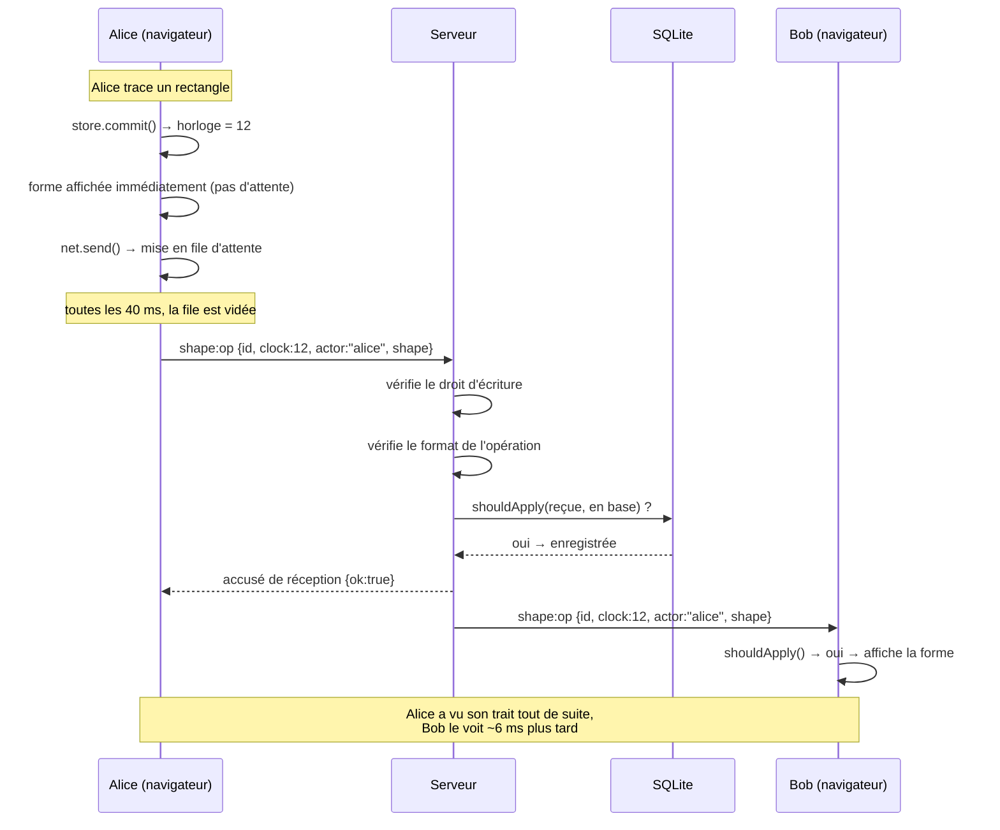
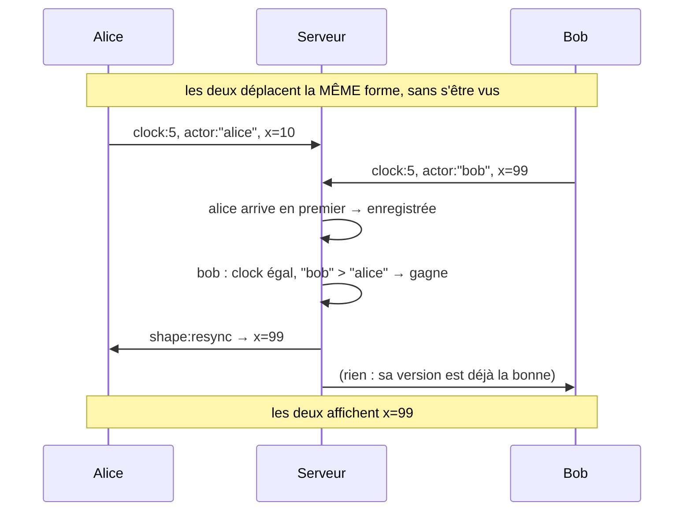

# Tableau blanc collaboratif en temps réel

Un tableau blanc infini, à plusieurs, dans le navigateur : on dessine, les
autres voient le trait apparaître en direct, et le dessin est sauvegardé.

Projet de stage — 8 semaines. Voir [`SUBJECT.pdf`](SUBJECT.pdf) pour le sujet
officiel, [`JOURNAL.md`](JOURNAL.md) pour le carnet de bord et
[`docs/choix-techniques.md`](docs/choix-techniques.md) pour la justification
détaillée des choix d'architecture.

---

## 1. Lancer le projet

**Prérequis :** Node.js 22 ou plus récent (testé avec Node 24), et Git.

```bash
# 1. Installer les dépendances (client + serveur)
npm run install:all

# 2. Copier la configuration du serveur
cp server/.env.example server/.env      # Windows : copy server\.env.example server\.env

# 3. Tout lancer (serveur + client)
npm run dev
```

Puis ouvrir **http://localhost:5173/**.

| Commande | Effet |
|---|---|
| `npm run dev` | Serveur (port 3000) + client (port 5173), rechargement automatique |
| `npm run dev:server` / `npm run dev:client` | Un seul des deux, dans deux terminaux séparés |
| `npm test` | Tests unitaires (serveur + client) |
| `npm run e2e` | Test de bout en bout : 2 utilisateurs, droits, partage, persistance |
| `npm run smoke` | Test des pages dans un navigateur simulé (jsdom) |
| `npm run load` | Test de charge : 6 participants simultanés |
| `npm run build` | Compile le client dans `client/dist/` |
| `npm start` | Serveur seul, qui sert aussi le client compilé (mode production) |

Les tests `e2e`, `smoke` et `load` ont besoin que le serveur tourne
(`npm run dev:server` dans un autre terminal).

---

## 2. Ce que ça sait faire

**Dessin** — canvas infini, déplacement (clic droit, molette, barre d'espace)
et zoom (`Ctrl` + molette). Outils : sélection/déplacement, main levée,
rectangle, ellipse, flèche, texte, gomme. 8 couleurs, épaisseur réglable,
remplissage. Undo/redo local. Export **PNG** et **JSON**, import JSON.

**Temps réel** — les formes et les curseurs (avec pseudo et couleur) sont
synchronisés en continu. Mesuré en local : **6 ms en moyenne, 9 ms au 95e
centile** avec 6 participants (objectif du sujet : 200 ms).

**Robustesse** — les modifications concurrentes sont fusionnées sans conflit
(voir §4). Si le réseau tombe, on continue de dessiner : les traits sont
renvoyés et fusionnés à la reconnexion.

**Comptes et partage** — inscription email/mot de passe, page « mes boards »,
boards publics ou privés, invitation par email ou par lien, avec droits
« peut regarder » ou « peut dessiner ».

---

## 3. Architecture

```
┌─────────────────── NAVIGATEUR ────────────────────┐
│                                                   │
│  pages/board.js ── assemble tout                  │
│      │                                            │
│      ├── board/tools.js    souris + clavier       │
│      ├── board/store.js    les formes + undo/redo │
│      ├── board/render.js   dessine le canvas      │
│      ├── board/camera.js   pan / zoom             │
│      └── board/net.js      Socket.IO + file       │
│                            d'attente d'envoi      │
└───────────────────────┬───────────────────────────┘
                        │  WebSocket + HTTP
┌───────────────────────┴───────────────────────────┐
│                     SERVEUR                       │
│                                                   │
│  routes.js      API HTTP (comptes, boards)        │
│  realtime.js    Socket.IO, une « room » par board │
│  permissions.js qui a le droit de quoi            │
│  boards.js      lecture/écriture des formes       │
│  db.js          SQLite (node:sqlite)              │
└───────────────────────────────────────────────────┘

shared/merge.js  ← la règle de fusion, utilisée des DEUX côtés
```

Le fichier `shared/merge.js` est importé par le navigateur **et** par le
serveur. C'est volontaire : les deux doivent appliquer exactement la même
règle, sinon ils divergeraient.

### Organisation des dossiers

```
client/    interface (Vite, JavaScript sans framework)
server/    serveur Node.js (Express + Socket.IO + SQLite)
shared/    code commun aux deux
scripts/   tests de bout en bout, tests de page, test de charge
docs/      document de choix techniques
```

---

## 4. Comment marche la synchronisation

### Diagramme de séquence — Alice dessine, Bob voit



### Que se passe-t-il si deux personnes modifient la même forme ?

La méthode retenue est **« la dernière écriture gagne » (LWW) par forme, avec
une horloge de Lamport**. Le sujet autorise explicitement cette approche
(« Last-write-wins with vector clocks (acceptable for shapes) »).

Une horloge de Lamport est un simple compteur, pas une heure :

- chaque participant garde un nombre `clock` ;
- quand il modifie une forme : `clock = max(clock connu) + 1` ;
- quand il reçoit une modification : `clock = max(clock, reçu)`.

Conséquence : si Alice modifie une forme **après avoir vu** celle de Bob, son
numéro est forcément plus grand, donc sa version gagne — l'ordre de causalité
est respecté sans jamais comparer les horloges des machines, qui peuvent être
déréglées.

Si les deux modifient la forme **sans s'être vus**, les numéros peuvent être
égaux. On départage alors par l'identifiant de l'auteur (comparaison de
texte). Le choix est arbitraire, mais **identique sur toutes les machines** :
c'est la seule chose qui compte pour que tout le monde converge.



Le fichier [`shared/merge.js`](shared/merge.js) contient cette règle en
30 lignes, et [`server/test/merge.test.js`](server/test/merge.test.js) vérifie
notamment qu'appliquer les deux opérations dans un ordre ou dans l'autre donne
le même résultat.

### Coupure réseau

Les opérations sont rangées dans une **boîte d'envoi** indexée par forme, vidée
toutes les 40 ms. Deux effets :

1. **Moins de messages** : bouger une forme pendant 2 secondes n'envoie pas
   200 messages mais ~50, car seule la dernière version de chaque forme est
   conservée dans la boîte. C'est correct précisément parce que la règle est
   « la dernière gagne ».
2. **Rien n'est perdu** : une opération reste dans la boîte tant que le serveur
   ne l'a pas confirmée. Si la connexion tombe, on continue de dessiner ; à la
   reconnexion tout est renvoyé, puis l'état du serveur est **fusionné** (et
   non écrasé) avec l'état local.

---

## 5. Sécurité

- Mots de passe hachés avec **scrypt** (fonction lente), sel aléatoire par
  compte, comparaison à temps constant.
- Cookie de session `HttpOnly` + `SameSite=Lax`, signé (HMAC-SHA256), et
  `Secure` en production.
- **Limitation de débit** : 120 requêtes/min par IP sur l'API, 10 tentatives
  de connexion d'un coup puis 1 toutes les 2 s, 120 opérations de dessin par
  seconde et par connexion.
- Les droits sont revérifiés **côté serveur** à chaque opération : l'auteur
  d'une forme est imposé par le serveur, jamais accepté depuis le client.
- Le jeton de partage n'est jamais renvoyé à quelqu'un qui n'est pas
  propriétaire du board.

---

## 6. Ce qui reste à faire

- **Déploiement** en ligne (HTTPS, URL publique) — nécessite des comptes
  personnels (hébergeur, nom de domaine).
- **Vidéo de démo** (~3 min) montrant deux navigateurs sur le même board.
- Connexion via **Google/GitHub** (OAuth) : le sujet propose « email + mot de
  passe **ou** OAuth », la première option est implémentée.
- Bonus non traités : chat vocal, images en fond, notes autocollantes,
  assistance IA, version mobile tactile, historique avec curseur temporel.
